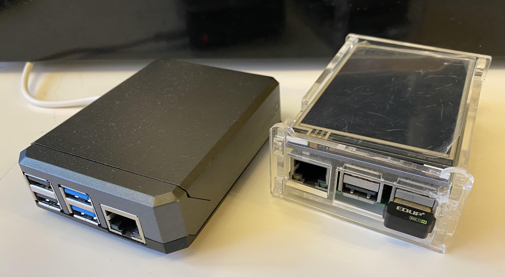
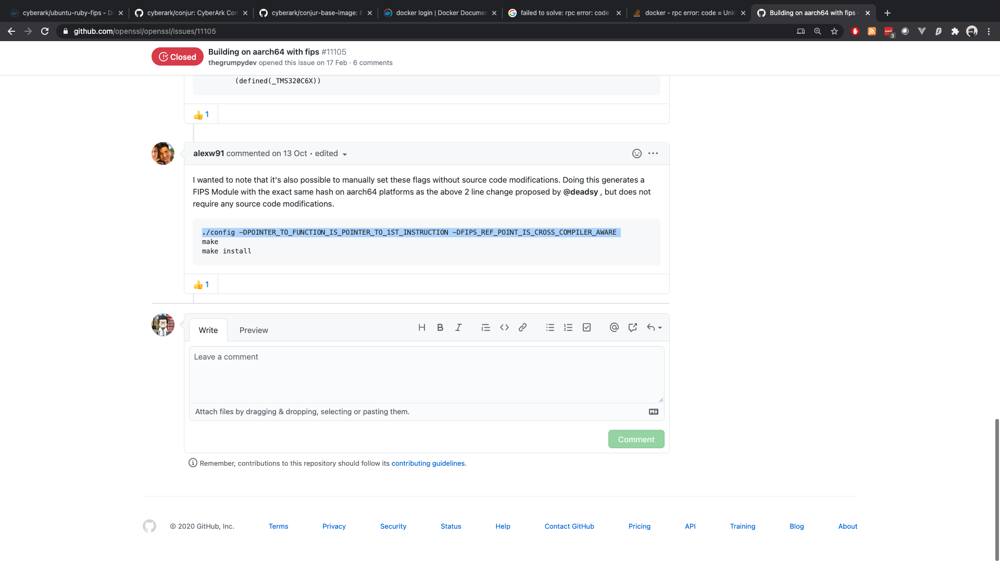

# conjur-arm64-blog

This is the draft of conjur-arm64 blog.

----

# TL;DR

This blog is about my jounry of building [CyberArk Conjur](https://www.conjur.org/ container image that works on both ARM-based & Intel/AMD-based computer.

If you're looking for a solution to execute Conjur on Pi4, you can download [docker-compose.yml](docker-compose.yml) & [.env](.env) files to spin up a the `quincycheng/conjur:latest` image that I built

# Why I am doing this?

As an IOT & single-board-computer lover, I recently pick up a Raspberry Pi 4 board as an upgrade of Pi2.
It got enough processing power to execute container-based apps, while operates in low voltage powered by USB.

Considering the power consumed by homelab VM farm, guess it's a good idea to run the 7x24 systems on Pi 4 instead of 220V VM systems.

*(left) Raspberry Pi 4 in Argon NEO Heatsink Case (right) Raspberry Pi 2 with 3.5" LCD HAT*

One of the apps that I use is [CyberArk Conjur](https://www.conjur.org/).    Together with [summon](https://cyberark.github.io/summon/), it's an awesome way to inject secrets to my container-based apps as well as CLI.

To make sure it can be executed on Pi4, we need to make sure the applications is arm64 compatible.
The first thing that I checked is Docker Hub.
After a quick search, I found that link to the image is [https://hub.docker.com/repository/docker/cyberark/conjur](https://hub.docker.com/repository/docker/cyberark/conjur)

As you can see if above screen capture, the offical repo got `linux/amd64` images, and no `linux/arm64`.
Before I give up the an idea, why don't we build one? 
It's an Open Source project, right?   

# Going down the rabbit hole

Okay, first thing first, let's get the source code.
With the [link](https://github.com/cyberark/conjur) from Docker Hub 

# 1st image: openssl-builder

# 2nd iamge: ubuntu-ruby-builder

# 3rd image: postgres-client-builder

# One level up! 4th image: ubuntu-ruby-fips

# Building conjur image, again

# Spin it up, with errors?

# Debug and try again

# Lessons Learnt

